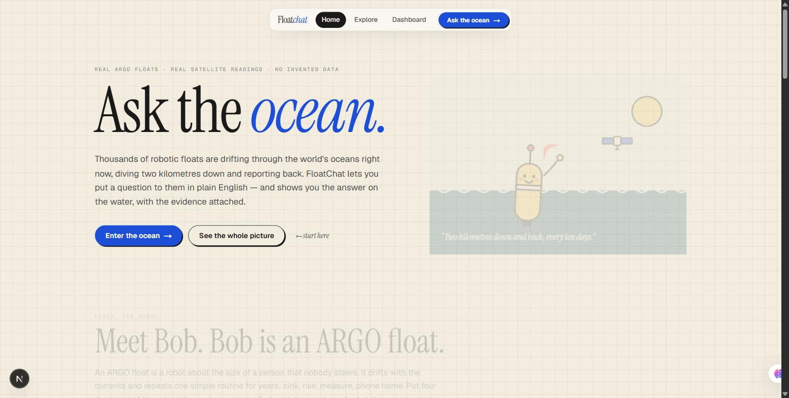
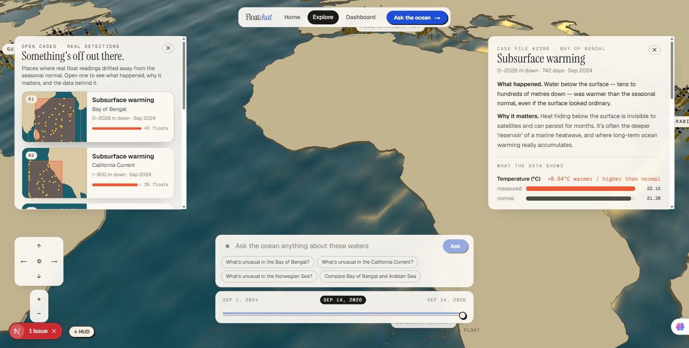
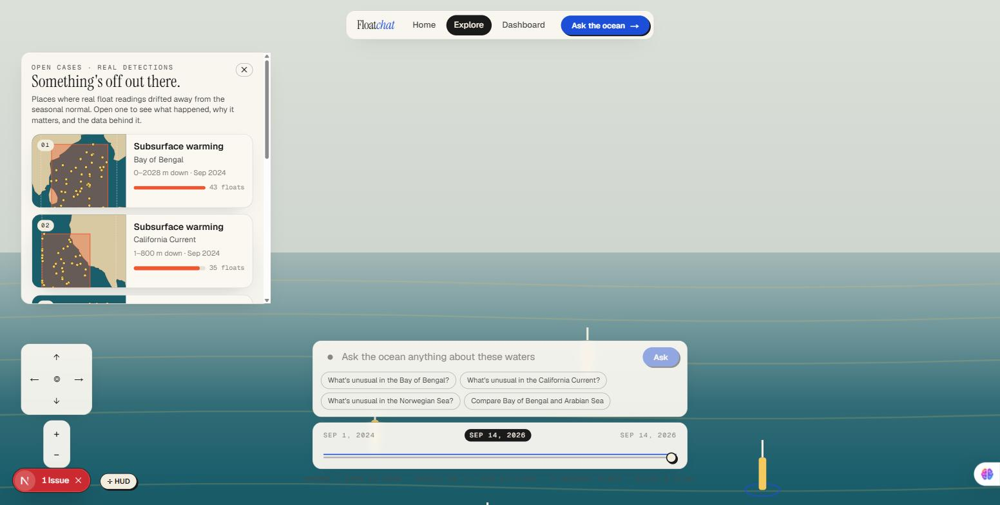
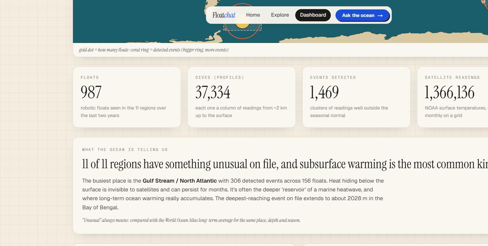
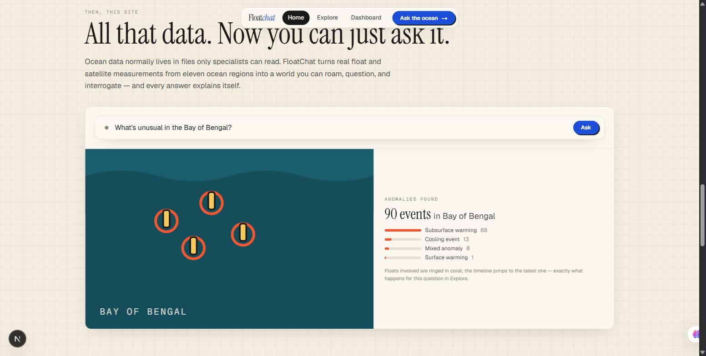

# FloatChat

**Ask the ocean a question in plain English — and watch the answer happen on the water, with
the real evidence attached.**

FloatChat turns two years of real [ARGO float](https://argo.ucsd.edu/) dives, satellite sea-surface
readings, and long-term climatology into an explorable 3D ocean world you can question directly.
No invented data, no fabricated confidence scores — every answer traces back to a real observation.



---

## What it does

- **Ask in plain English.** "What's unusual in the Bay of Bengal?", "Compare the Arabian Sea and
  Bay of Bengal", "What is a thermocline?", "How do you know this is unusual?" — a Gemini-powered
  query layer turns the question into a validated, structured request. The model never touches
  the database or invents a number; it only selects from a controlled set of real data tools.
- **Watch the world answer.** The camera flies to the place, the floats involved light up, the
  timeline jumps to when it happened — the answer *is* the world changing, not a chat transcript.
- **Every conclusion shows its work.** An evidence panel traces each detected event back through
  the real floats, dives, and observations that produced it, compared against a genuine long-term
  baseline (World Ocean Atlas 2023).



## The data is real

| | |
|---|---|
| **987** | robotic ARGO floats tracked across 11 ocean regions |
| **37,334** | real dive profiles (surface → ~2 km and back) |
| **1,469** | anomaly events detected against the WOA23 seasonal baseline |
| **1.37M** | NOAA satellite sea-surface temperature readings |
| **24 months** | rolling ingestion window, kept current |

Sources: [ARGO GDAC](https://argo.ucsd.edu/) (via [Argovis](https://argovis.colorado.edu/)),
[NOAA OISST v2.1](https://www.ncei.noaa.gov/products/optimum-interpolation-sst), and
[World Ocean Atlas 2023](https://www.ncei.noaa.gov/products/world-ocean-atlas) — nothing
simulated, nothing hand-authored.



## Everything, all at once

The Dashboard turns the same data into one honest picture of the whole dataset: where the floats
are, how much has been measured, and where the ocean has stepped outside its seasonal normal —
with a plain-language reading derived from the real numbers, not written in advance.



A real example question lives right on the home page too — type nothing, just scroll: it types a
real question, the floats highlight, and the same real answer the live Ask bar would give appears
next to it.



---

## Architecture

A hard boundary, enforced throughout the codebase — this is the one rule the whole project holds
itself to:

```
LLM               = understands, plans, selects tools, explains — never calculates, never invents data
Scientific engine = retrieves and calculates — deterministic, testable
Database          = stores source-derived/processed data with provenance and QC
Evidence engine   = proves where a result came from
Frontend          = visualizes backend-derived state only
```

Concretely:

- **Frontend** — Next.js (App Router) + React Three Fiber / Three.js for the 3D ocean world
  (procedural Gerstner-wave water, real coastline geometry, a free-roam camera with altitude
  bands), Zustand for state, Tailwind for the "Field Notebook" visual system.
- **Backend** — FastAPI (async), SQLAlchemy 2.0 + PostGIS for real geospatial queries, a
  deterministic scientific engine (baseline anomaly detection, thermocline depth, DBSCAN
  spatio-temporal event clustering — not ML classification), and a full evidence chain from
  event → floats → profiles → raw observations.
- **LLM query layer** — Gemini API, structured (`responseSchema`-constrained) extraction only,
  an orchestrator that independently re-validates every extraction and dispatches to a fixed,
  allow-listed set of real data tools. Ambiguous questions get a clarifying question back, never
  a guess.

## Tech stack

| | |
|---|---|
| **Frontend** | Next.js 16, React 19, React Three Fiber, Three.js, drei, GSAP, Zustand, Tailwind CSS 4 |
| **Backend** | FastAPI, SQLAlchemy 2.0 (async), PostgreSQL + PostGIS, asyncpg |
| **Scientific computing** | xarray, NumPy, SciPy, pandas, scikit-learn (DBSCAN), netCDF4 |
| **AI** | Gemini API (`gemini-3.5-flash-lite`), structured tool calling only |
| **Data** | ARGO GDAC (via Argovis), NOAA OISST v2.1, World Ocean Atlas 2023 |

---

## Getting started

### Prerequisites

- Node.js 20+
- Python 3.11+
- PostgreSQL with the PostGIS extension
- A free [Gemini API key](https://aistudio.google.com) ("Get API key")

### Backend

```bash
cd backend
python -m venv .venv
./.venv/Scripts/activate        # Windows; `source .venv/bin/activate` on macOS/Linux
pip install -r requirements.txt
cp .env.example .env            # fill in DATABASE_URL and GEMINI_API_KEY
uvicorn app.main:app --reload   # http://localhost:8000/health
```

### Frontend

```bash
cd frontend
npm install
cp .env.example .env.local      # NEXT_PUBLIC_API_URL, defaults to localhost:8000
npm run dev                     # http://localhost:3000
```

### Data ingestion

The app needs real data behind it before Explore/Dashboard show anything. From `backend/`, with
the venv active:

```bash
python scripts/ingest_argo.py      # real ARGO floats/profiles, rolling 24-month window, 11 regions
python scripts/ingest_sst.py       # real NOAA OISST satellite SST for the same regions/period
python scripts/detect_events.py    # derives real Event/Anomaly/Evidence rows from the above
```

WOA23 climatology (needed for anomaly/thermocline calculations) is a separate download — see the
`get_expected_batch`/baseline loader in `backend/app/anomaly/baseline.py` for the exact NCEI
source files it expects under `data/raw/woa23/`.

---

## Deploying

The **frontend** is a standard Next.js app and deploys to [Vercel](https://vercel.com) as-is —
set `NEXT_PUBLIC_API_URL` in the Vercel project's environment variables to point at wherever the
backend ends up running.

The **backend** is a stateful FastAPI service with a PostgreSQL/PostGIS database behind it, so it
needs a host that runs a persistent process (Render, Fly.io, Railway, a VM, etc.) rather than
Vercel's serverless functions — set `GEMINI_API_KEY`, `DATABASE_URL`, and `CORS_ORIGINS` (to
include the deployed frontend's origin) there.

---

## Project layout

```
frontend/   Next.js + React Three Fiber ocean world, Ask UI, Dashboard
backend/    FastAPI app — ingestion, scientific engine, event/evidence engine, LLM query layer
  app/        source (api/ schemas/ models/ ingestion/ anomaly/ events/ query/ llm/ ocean/)
  scripts/    ingest_argo.py, ingest_sst.py, detect_events.py
  tests/      pytest suite, run against real ingested data
data/       raw/ + processed/ (gitignored — populated locally by the ingestion scripts)
```

## Scientific honesty

No fabricated observations, float IDs, events, or confidence scores — anywhere, including
placeholder/empty states. Sparse or missing data is disclosed, not papered over. "Unusual" always
means measured against the real World Ocean Atlas long-term average for that place, depth, and
season — never a guess.
